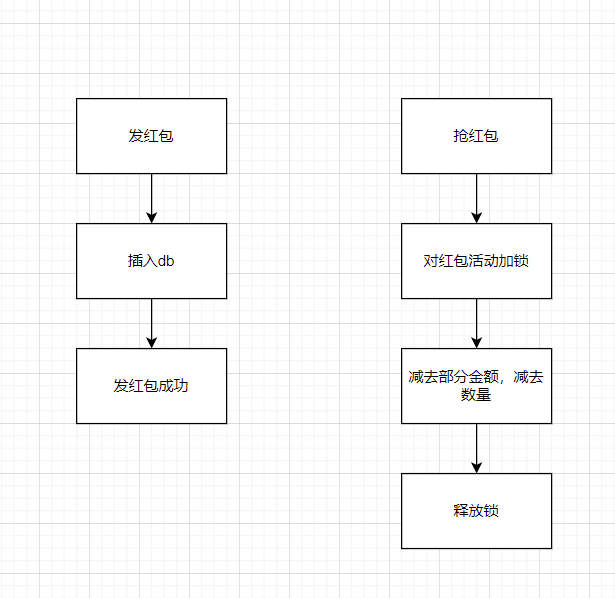
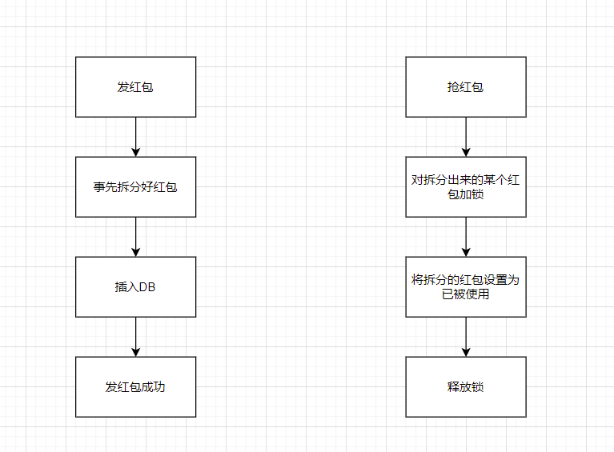
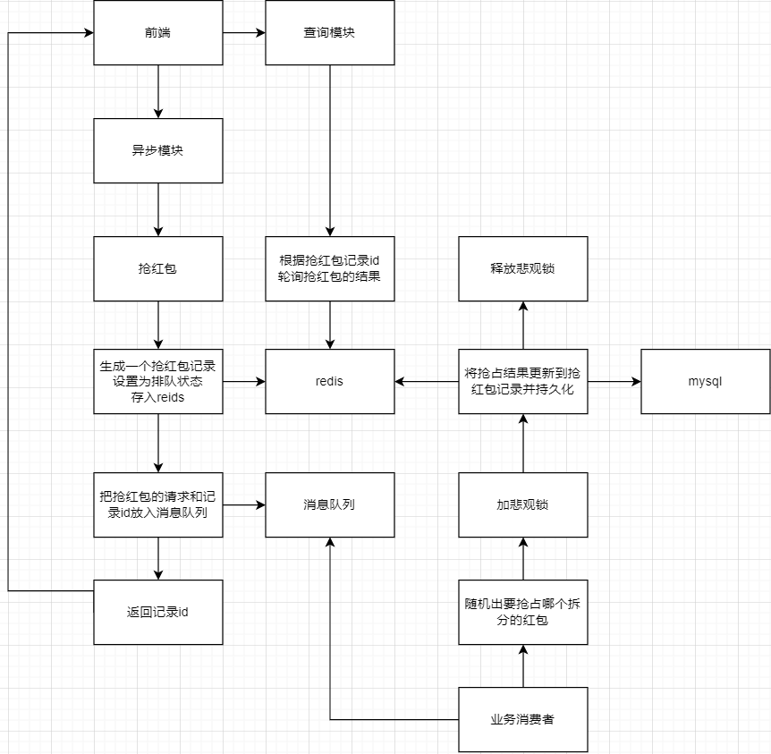
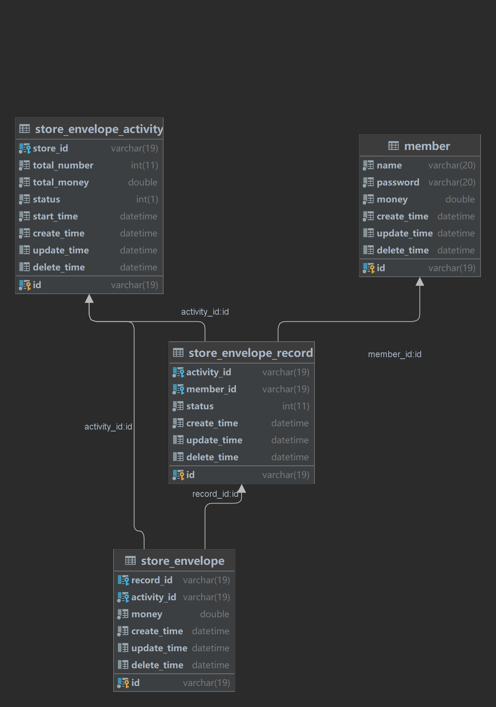

# 电商红包系统

## 目前进度

完成了大部分功能 还有一些功能需要完善

## 项目描述

区别于社交平台的好友对好友的红包，这是一个为电商商铺向其它用户发送红包以达到宣传目的的一个场景。从系统本质来说，和秒杀系统类似。这是一个基于`spring cloud`等一些列组件+`k8s`实现的一个微服务项目。系统的一些设计参考于[解密抖音春节红包背后的技术设计与实践 - 掘金](https://juejin.cn/post/7111252917151072293)。

## 技术栈

| 技术栈                    | 说明             |
|:-----------------------|:---------------|
| Spring Boot            | 基础搭建以及和第三方整合   |
| Spring Cloud OpenFeign | RPC调用          |
| MyBatis+Mysql          | 持久化            |
| Redis                  | 数据缓存           |
| Redisson               | 分布式锁           |
| RabbitMQ               | 消息队列           |
| Docker                 | 镜像打包           |
| K8s                    | 服务发现、负载均衡、项目部署 |

## 接口文档

[接口文档在线分享 - Apifox](https://www.apifox.cn/apidoc/shared-06d43e5d-7742-4e0a-bb6a-c03fa87e2beb/api-37202006)

## 微服务模块分划

| 模块     | 作用                                     |
| ------ | -------------------------------------- |
| api    | 调度其它模块、流量限制、服务降级                       |
| core   | 写入数据库的业务                               |
| query  | 读取数据库的业务                               |
| async  | 异步的业务                                  |
| common | 提供其他模块常用的一些功能，比如数据库的增删改查，id生成（雪花算法）之类。 |

## 业务实现方法的选择

### 红包是否需要预先拆分

#### 不拆分

#### 拆分

#### 最终选择

最后选择的是拆分的方案。不拆分的话，是对整个红包活动上锁，一个活动的所有请求都会被一个锁控制。拆分的话，则是将这个活动的锁也拆分了，一个活动的请求被多个锁控制，效率上第二个更高。

### 使用乐观锁还是悲观锁

乐观锁的话，就是对红包进行抢占，如果版本号小于当前版本号则认为已经有别的请求抢占了，则抢占失败。

悲观锁的话，则是先拿到锁的请求（假设符合抢占条件）能抢占成功。

以提前拆分红包的方案为例，很多请求打到一个拆分的红包上，频繁的修改会引起冲突（修改的场景比较频繁），在请求足够多的情况，悲观锁效率更高。

## 最终实现的方案

## 数据库模型

## 开发过程中对分布式锁的逐渐优化

### 场景

在抢红包的过程中，需要用到悲观锁，虽然使用了消息队列，但这个项目是一个微服务的，消息队列可能不能使请求串行化，需要利用redis实现分布式锁。

### 第一阶段

简单的用redis的setnx进行加锁，这个时候碰到的问题就是，如果业务发生问题，并没有让锁释放，则会导致锁一直处于一个拿不到的状态。

### 第二阶段

为了解决第一阶段的问题，需要对锁设置一个过期时间。比较新的版本spring-boot-starter-data-redis的RedisTemplate的setnx可以传入一个参数设置过期时间，这个操作是具有原子性的。

### 第三阶段

锁会自己过期，这又会导致一个问题，就是业务超时的场景。业务其实没有发生问题，但是执行时间过久，那么第一个请求的锁已经过期了且第二个请求加上了锁，那么第一个请求结束后去释放锁，此时释放的会是第二个请求的锁。那么之后的请求的锁的释放就都会变成前面的请求释放后面请求的锁，导致了锁的混乱。为了解决这个问题，需要对锁设置一个id，只有持有这个id的请求才能释放对应的锁。

### 第四阶段

业务超时这个场景还会导致一个问题，就是提前释放掉锁了，那么就有可能导致两个请求并行了，那么可能会导致一些数据的混乱。业务的执行时间又不是一个那么容易估计的一个值，无法确定设置锁的过期时间多久合适。为了解决这个问题，则需要用到可重入锁，在业务执行期间不断的去获取这个锁，redisson就提供了这个思路的实现。最终使用redisson实现了分布式锁。
